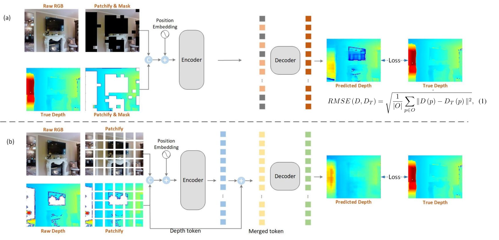

## Introduction

The repository is the code implementation of the paper [A Two-Stage Masked Autoencoder Based Network for Indoor Depth Completion](https://arxiv.org/abs/2406.09792), based on [MAE](https://github.com/facebookresearch/mae) projects.





If you find this project helpful, please give us a star ⭐️, your support is our greatest motivation.

## Table of Contents

- [Introduction](#introduction)
- [Installation](#installation)
- [Dataset Preparation](#dataset-preparation)
- [Model Training](#model-training)
- [Model Testing](#model-testing)
- [Image Prediction](#image-prediction)
- [Acknowledgements](#acknowledgements)
- [Citation](#citation)
- [License](#license)
- [Contact Us](#contact-us)

## Installation

### Dependencies

- Ubuntu
- Python 3.7+, recommended 3.7.0
- PyTorch 1.9.0 or higher, recommended 1.9.1+cu111
- CUDA 12.4 or higher, recommended 12.4

### Environment Installation

We recommend using Miniconda for installation. The following command will create a virtual environment named `idc` and install PyTorch.

Note: If you have experience with PyTorch and have already installed it, you can skip to the next section. Otherwise, you can follow these steps to prepare.


**Step 0**: Install [Miniconda](https://docs.conda.io/projects/miniconda/en/latest/index.html).

**Step 1**: Create a virtual environment named `ttp` and activate it.

```shell
conda create -n ttp python=3.7 -y
conda activate idc
```

**Step 2**: Install [PyTorch2.1.x](https://pytorch.org/get-started/locally/).

Linux:
```shell
pip install torch==1.9.1 torchvision==0.10.1 torchaudio==0.9.1 --index-url https://download.pytorch.org/whl/cu111
```

**Step 3**: Install [timm]

```shell
pip install timm=0.4.9
```

**Step 4**: Install other dependencies.

```shell
pip install matplotlib scipy numpy opencv-python pillow typing-extensions=4.2.0
```

### Install IDC


Download or clone the repository.

```shell
git clone git@github.com:kailaisun/Indoor-Depth-Completion.git
cd Indoor-Depth-Completion
```

## Dataset Preparation


#### Dataset Download

Image and label download address: [Matterport3D for Depth Completion](https://1drv.ms/u/s!AnkbiBgsbBltntRh0bcwZx4Xfp2xwA?e=rwXsTe). It includes:


- train_full : A training dataset of npy files which is concatenated from rgb images, raw depth images and gt depth images for finetuning.
- test_full : A testing dataset of npy files which is concatenated from rgb images, raw depth images and gt depth images for finetuning.


## Model Training

#### Pretraining

```shell
python main_pretrain.py  --data_path /npy/train 
```

#### Finetuning

```shell
python main_fintune_full.py  --data_path /npy/train_full --eval_data_path /npy/test_full
```

## Model Testing

#### Checkpoints:

-Pretraining:[Download](https://1drv.ms/u/s!AnkbiBgsbBltncFzOKh44t9DHR6Aiw?e=ivNDxH)

-Finetuning:[Download](https://1drv.ms/u/s!AnkbiBgsbBltncF0u-3e5rkH2yOTkg?e=WQ1wle)

#### Evaluation and Depth Image Prediction:

```shell
python eval_full.py --data_path /npy/test_full --checkpoint /checkpoint-finetune.pth --output_dir /output # data_path is the file to be tested, checkpoint is the checkpoint file you want to use, output_dir is the output path of the prediction result, including predicted depth images and point clouds.
```

## Acknowledgements

The repository is the code implementation of the paper [A Two-Stage Masked Autoencoder Based Network for Indoor Depth Completion](https://arxiv.org/abs/2406.09792), based on [MAE](https://github.com/facebookresearch/mae) projects.

## Citation

If you use the code or performance benchmarks of this project in your research, please refer to the following bibtex to cite.

```
@misc{sun2024twostage,
      title={A Two-Stage Masked Autoencoder Based Network for Indoor Depth Completion}, 
      author={Kailai Sun and Zhou Yang and Qianchuan Zhao},
      year={2024},
      eprint={2406.09792},
      archivePrefix={arXiv},
      primaryClass={cs.CV}
}
```


## License

The repository is licensed under the [Apache 2.0 license](LICENSE).

## Contact Us

If you have other questions❓, please contact us in time 👬
